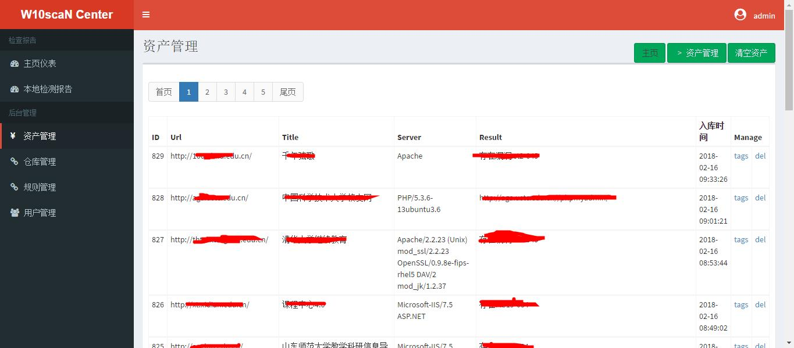
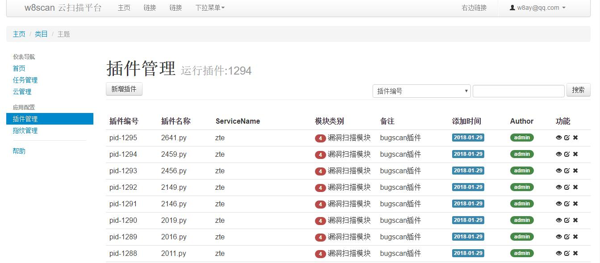
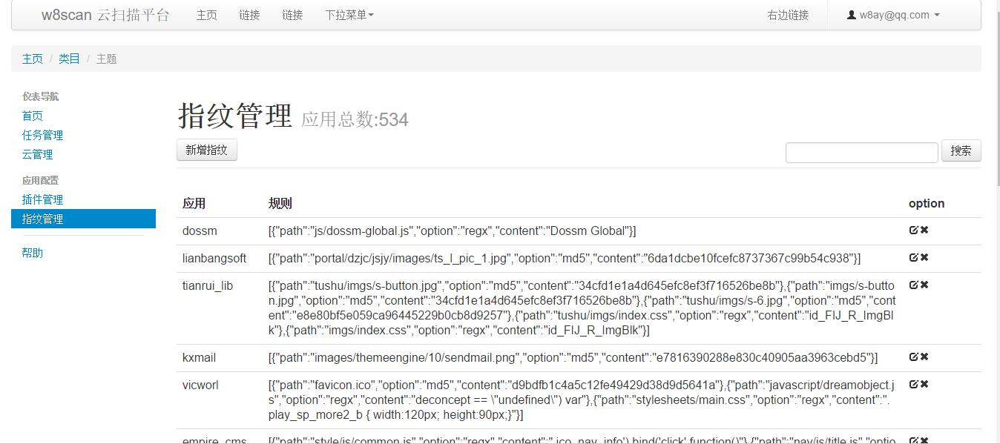
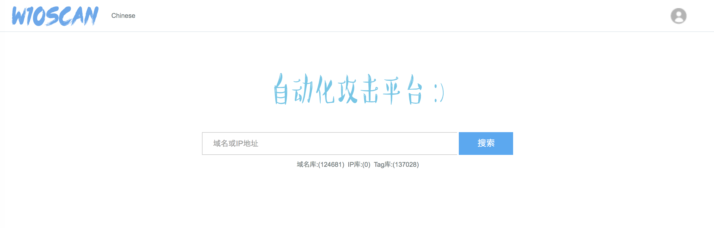
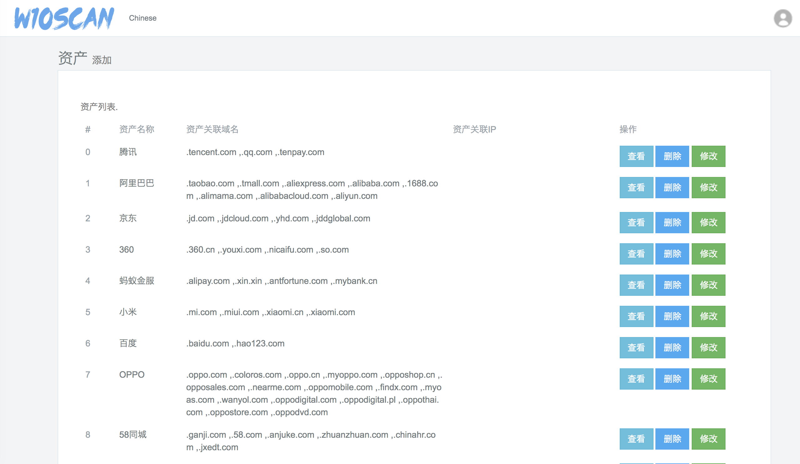
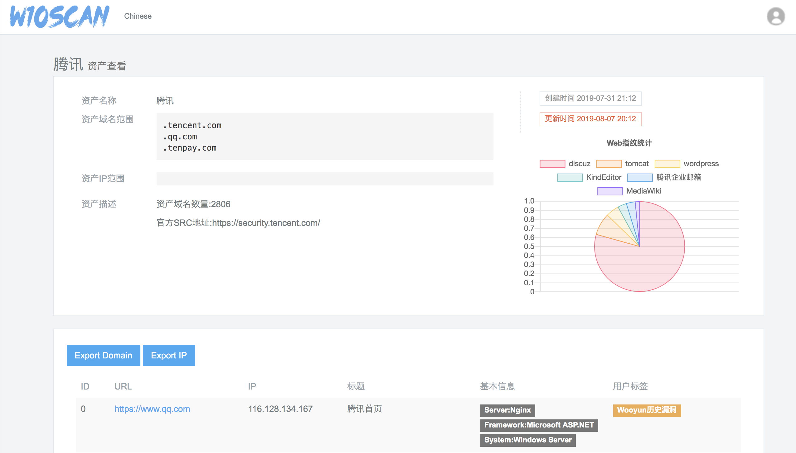
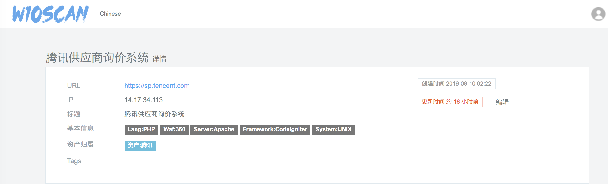
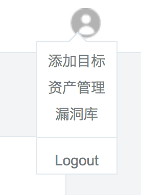

# w10scan
w10scan是一款全自动搜索互联网漏洞的工具。利用搜索到的url或全自动的超级爬虫获取大量链接，使用定向插件获得漏洞。这一切都是全自动的，用户只需要在web界面上增加插件，设置参数，查看结果。分布式 任务下发模式

## 启发
受到`Autosploit`的启发，一款自动漏洞搜寻工具，但是利用方式和`Autosploit`大不一样，`Autosploit`基于`metasploit`与`shodan`结合。但w10scan使用自己的`w10scan超级爬虫`，对网站进行深度优先级爬行，一直递归重复获取更多网址，当然，w10scan的超级爬虫可以指定获取的域名方式以及关键字方式。漏洞利用使用`w9scan`的改良版本，通过一些特定漏洞以及CMS对应漏洞结合的方式获取情报信息。

## 好玩
写此工具的目的仅是为了好玩，获取的什么情报，资产也是为了好玩。我也很想开源展示效果，但是由于我国法律不允许，可能仅开源部分代码,此github也是仅在无聊的时候记录日志。  
Po个demo图:  

## 与w8scan联动
与w8scan的指纹平台和插件平台联动，w10scan的插件指纹平台就不自己写了，直接调用w8scan平台的数据。

## Log(时间倒序)
- 2018-6-25 一个新的想法
    - 架构为一个网页端多个客户端，分布式扫描
        1. 网页端下发域名和IP
        2. 自动收集域名扫描，暴露出公共的接口，可以让其他软件调用该接口扫描。
    - 客户端扫描以下
        - 扫描域名
            1. 识别脚本语言，若为php则增加识别版本
            2. 识别server
            3. 识别waf？有，入库，扫描完毕,无？继续扫描，传入ip，检测IP是否已扫描，未扫描则启动“扫描IP”服务。
            4. git svn扫描
            5. 备份文件扫描
            6. 目录扫描
            7. 常见文件扫描
            8. cms扫描
        - 扫描IP
            1. 开放端口扫描 + 分析指纹
            2. 开放端口弱口令扫描
    - 细节
        - 字典优化：目录扫描，字典扫描增加计数字段dict_count用于计数，当我们的关键词命中时，对应的dict_count+1，每次使用字典时候，通过order by dict_count desc提权关键词，生成关键词命中次数降序的字典。文件扫描，cms指纹同理。
- 2018-4-2 扫描流程加入CMS识别 + 自动漏洞利用，IP端口分析调用nmap。waf信息，IP端口信息，CMS信息都将入库，统计图表展示。漏洞信息，发现的漏洞类型也分类，统计成图表。虽然目前整个系统看起来没什么作用，但感觉还是很高大上的~
- 2018-3-4 目前完整的扫描流程已经确定: 
  1. 大批量信息收集，资产信息:IP，子域名
  2. 过滤不能访问的和有waf的  
  3. Fuzz批量测试  
  4. 爬虫爬取相关链接  
  5. SQL注入,XSS批量测试  
  批量的SQL注入已经初显成效，但还需要优化，用的普通取文本md5判断注入，准备看看SQLMAP中检测注入是如何进行的。
- 2018-2-22 第一批加入的3w网址扫完了，得出了300+漏洞信息，本来想着改改线程池重写的，现在觉得没必要，服务器宽带在那还能怎么优化呢。现在主要就是想加各种插件，调用sqlmapapi云云之类的。最近三个项目`w8scan` `w9scan` `w10scan`一起开工，这个写累了就跑那个，很有趣！
- 大年初三:测试版没有崩溃了，但是速度太慢了，一晚上才跑7000+网址，准备重写线程池在跑
- 大年初一：之前的demo版在腾讯云的小水管上跑了一晚上扫了1w+网址，得出了500多个漏洞信息，现在的改良版却扫个千把链接就崩溃了，很无奈。还有半个小时就大年初二，给最终版本喂了8000 URL，扫扫看吧。之前不觉得问题，现在觉得1M的小水管扫太慢了，线程50都Hold不住嘛？？

## 2.0 最新更新

更新时间 2019.8.17

已经好久没有更新w10scan了，在w10scan之后也陆续创造了w11scan,w12scan,w13scan。最近我将w10scan小小的更新了下，简直容貌焕发。

### 为什么更新

相比于w12scan需要较高的机器配置运行，w10scan只需1H1G便足够运行（这是主要原因，我的服务器跑不动w12scan..qwq）。

### 更新内容

w10scan原来的定义是自动攻击系统，在这之上将w12scan中资产的构想更新到其中，会存储扫描过的域名以及一些基本信息，方便资产收集。数据库选用的mysql，语言是php，至今数十万的域名都可以轻松跑起来～

也将w12scan中打标签(tag)的概念加入到w10scan中，可以向这个域名打个标签，可以是漏洞，可以是其他等等信息，搜索时提供了从标签搜索的选项，可以更好发现资产。同时我将爬取的wooyun 8w数据库做了解析，将其中的域名和地址抽离出来，存入了tag库，在搜索域名时，可以轻松看到该域名的历史漏洞了。

### 纪念图

首页图

资产管理

资产管理详情

域名详情

也加入了一个漏洞库，可以保存自己团队发现的漏洞。这个系统给一些安全团队使用真的再好不过了～

